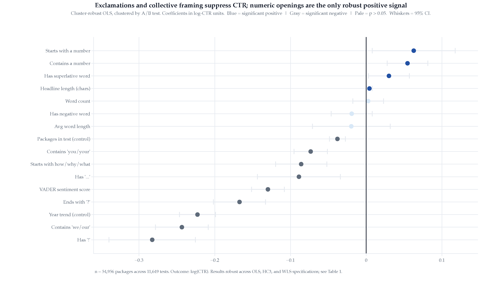
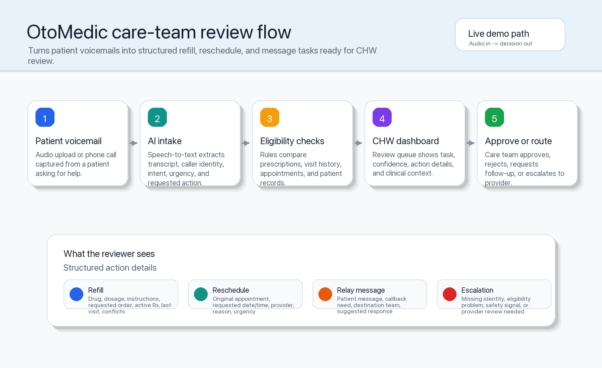
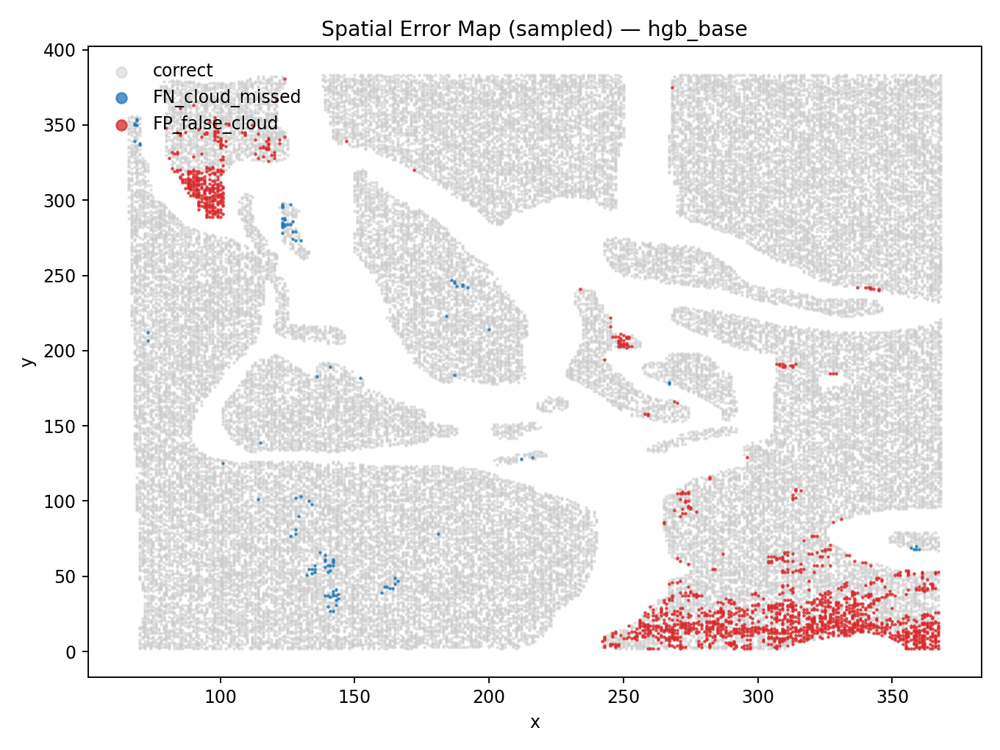
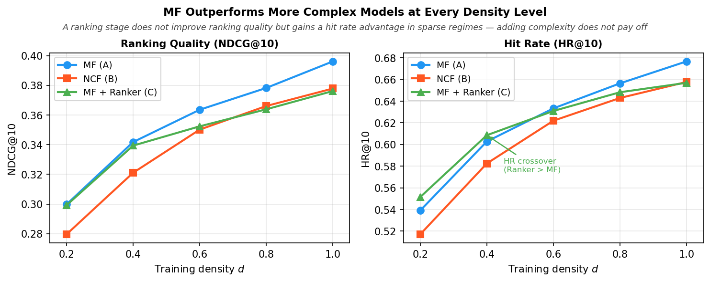

```{=html}
<div class="rpc-hero-section">
  <div class="rpc-hero-inner">
    <div class="rpc-hero-copy">
      <p class="rpc-hero-kicker">Ricardo Pérez Castillo · Data Scientist</p>
      <div class="rpc-hero-name" aria-hidden="true">I build models and the tools that let people try them.</div>
      <p class="rpc-hero-blurb">I’m a data scientist with 4+ years at McKinsey and Deloitte and an M.A. in Statistics from UC Berkeley. I like taking analysis past the notebook—into interactive tools, reproducible evaluations, and products people can actually use.</p>
      <div class="rpc-hero-actions">
        <a class="rpc-button rpc-button-primary" href="#selected-work">Explore selected work</a>
        <a class="rpc-button rpc-button-secondary" href="projects.html">View all projects</a>
      </div>
      <div class="rpc-hero-foot">
        <span class="rpc-availability"><span aria-hidden="true"></span> Open to data science and applied ML roles</span>
        <a href="mailto:ricardoperez@berkeley.edu">Email</a>
        <a href="https://www.linkedin.com/in/ricardoperezcastillo/" target="_blank" rel="noopener noreferrer">LinkedIn</a>
        <a href="https://github.com/ricardo-pc" target="_blank" rel="noopener noreferrer">GitHub</a>
      </div>
    </div>
    <figure class="rpc-hero-portrait">
      
      <figcaption>Statistics, product thinking, and enough engineering to make the demo real.</figcaption>
    </figure>
  </div>
</div>
```

::: {.rpc-body}

## Selected work {#selected-work}

The projects I would start with. Each one has something you can inspect, challenge, or try for yourself.

```{=html}
<div class="rpc-featured-grid">
  <article class="rpc-work-card rpc-work-card-lead">
    <a class="rpc-work-image" href="posts/upworthy-ab-testing/index.html" aria-label="Read the Upworthy headline analysis case study">
      
    </a>
    <div class="rpc-work-copy">
      <p class="rpc-work-type">Lead case study · Interactive</p>
      <h3>What Makes a Headline Work?</h3>
      <p>Using 54,956 headline variants from 11,649 A/B tests, I found which writing choices consistently changed click-through rate—and which apparent findings disappeared once the uncertainty was estimated correctly.</p>
      <p class="rpc-work-result"><strong>Result:</strong> ten stable signals, one false positive caught, and an interactive version built from the fitted model.</p>
      <div class="rpc-work-links">
        <a href="posts/upworthy-ab-testing/index.html">Read case study →</a>
        <a href="https://ricardo-pc.github.io/A-B-testing-analysis-upworthy/" target="_blank" rel="noopener noreferrer">Try the interactive analysis ↗</a>
      </div>
    </div>
  </article>

  <article class="rpc-work-card">
    <a class="rpc-work-image" href="posts/mutationrx/index.html" aria-label="Read the MutationRx case study">
      
    </a>
    <div class="rpc-work-copy">
      <p class="rpc-work-type">Applied AI · Live app</p>
      <h3>MutationRx</h3>
      <p>A resistance-aware drug-repurposing tool that combines docking, uncertainty estimates, and grounded review to help researchers decide which computational hits are worth testing.</p>
      <div class="rpc-work-links">
        <a href="posts/mutationrx/index.html">Case study →</a>
        <a href="https://mutationrx.onrender.com" target="_blank" rel="noopener noreferrer">Open app ↗</a>
      </div>
    </div>
  </article>

  <article class="rpc-work-card">
    <a class="rpc-work-image" href="posts/otomedi/index.html" aria-label="Read the Otomedi case study">
      
    </a>
    <div class="rpc-work-copy">
      <p class="rpc-work-type">AI systems · Interactive demo</p>
      <h3>Otomedi</h3>
      <p>A multi-agent workflow that turns missed clinic voicemails into reviewed actions, with deterministic checks and a human owning every clinical write.</p>
      <div class="rpc-work-links">
        <a href="posts/otomedi/index.html">Case study →</a>
        <a href="https://otomedi.vercel.app/demo" target="_blank" rel="noopener noreferrer">Run the demo ↗</a>
      </div>
    </div>
  </article>

  <article class="rpc-work-card">
    <a class="rpc-work-image" href="posts/arctic-cloud-detection/index.html" aria-label="Read the Arctic cloud detection case study">
      
    </a>
    <div class="rpc-work-copy">
      <p class="rpc-work-type">Applied ML · Interactive</p>
      <h3>Cloud or Ice?</h3>
      <p>A pixel-level cloud detector whose 0.996 AUC fell to 0.89 on a different orbit. The useful result was understanding why—and making that failure explorable.</p>
      <div class="rpc-work-links">
        <a href="posts/arctic-cloud-detection/index.html">Case study →</a>
        <a href="https://ricardo-pc.github.io/arctic-cloud-detection/" target="_blank" rel="noopener noreferrer">Explore the detector ↗</a>
      </div>
    </div>
  </article>

  <article class="rpc-work-card">
    <a class="rpc-work-image" href="posts/cs289-ranking/index.html" aria-label="Read the recommender systems case study">
      
    </a>
    <div class="rpc-work-copy">
      <p class="rpc-work-type">Machine learning · Interactive</p>
      <h3>When Does Ranking Help?</h3>
      <p>Three recommender systems, five sparsity levels, and a result that favored the simplest model. The interactive version lets you change the data density and test the models yourself.</p>
      <div class="rpc-work-links">
        <a href="posts/cs289-ranking/index.html">Case study →</a>
        <a href="https://ricardo-pc.github.io/cs289-ranking/" target="_blank" rel="noopener noreferrer">Try the recommender ↗</a>
      </div>
    </div>
  </article>
</div>
```

```{=html}
<p class="rpc-see-all"><a href="projects.html">Browse all twelve projects →</a></p>
```

## What I work on

```{=html}
<div class="rpc-capabilities">
  <div class="rpc-capability">
    <span>01</span>
    <h3>Experimentation &amp; statistics</h3>
    <p>A/B testing, regression, Bayesian methods, causal inference, and the unglamorous checks that keep a result honest.</p>
  </div>
  <div class="rpc-capability">
    <span>02</span>
    <h3>Applied machine learning</h3>
    <p>Classification, NLP, recommenders, forecasting, and model evaluation under real data constraints.</p>
  </div>
  <div class="rpc-capability">
    <span>03</span>
    <h3>AI products &amp; data systems</h3>
    <p>Agent workflows, human review boundaries, APIs, data pipelines, and interfaces that make the model usable.</p>
  </div>
</div>
<p class="rpc-tool-line"><strong>Tools I reach for:</strong> Python, SQL, R, scikit-learn, PyTorch, FastAPI, Postgres, dbt, Snowflake, GCP, and GitHub Actions.</p>
```

## About {#about}

```{=html}
<div class="rpc-about-grid">
  <p class="rpc-about-lead">Most of my projects start with a concrete question, not a model.</p>
  <div>
    <p>I enjoy the full path from messy data and model design to the interface or system that makes the result useful. That is why several projects here include an interactive version alongside the technical write-up.</p>
    <p>I spent more than four years at McKinsey and Deloitte working across data engineering, analytics, and consulting before completing the M.A. in Statistics at UC Berkeley.</p>
  </div>
</div>
```

## Experience

```{=html}
<div class="rpc-entries">
  <div class="rpc-entry">
    <div class="rpc-entry-header">
      <span class="rpc-entry-org">McKinsey &amp; Company</span>
      <span class="rpc-entry-date">Jul 2022 – Jul 2025</span>
    </div>
    <div class="rpc-entry-sub">Data Engineer / Data Analyst / Consultant</div>
  </div>
  <div class="rpc-entry">
    <div class="rpc-entry-header">
      <span class="rpc-entry-org">Deloitte</span>
      <span class="rpc-entry-date">Jan 2021 – Jun 2022</span>
    </div>
    <div class="rpc-entry-sub">Consulting Analyst</div>
  </div>
</div>
```

## Education

```{=html}
<div class="rpc-entries">
  <div class="rpc-entry">
    <div class="rpc-entry-header">
      <span class="rpc-entry-org">University of California, Berkeley</span>
      <span class="rpc-entry-date">Aug 2025 – May 2026</span>
    </div>
    <div class="rpc-entry-sub">M.A. in Statistics</div>
    <div class="rpc-entry-note"><a href="coursework.html">View coursework →</a></div>
  </div>
  <div class="rpc-entry">
    <div class="rpc-entry-header">
      <span class="rpc-entry-org">Tecnológico de Monterrey</span>
      <span class="rpc-entry-date">Jan 2015 – Dec 2019</span>
    </div>
    <div class="rpc-entry-sub">B.S. in Chemical Engineering</div>
  </div>
</div>
```

## Let’s talk {#contact}

```{=html}
<div class="rpc-contact-block">
  <p>I’m open to data science and applied ML roles. If the work here connects with something your team is building, I’d be glad to talk.</p>
  <div class="rpc-contact-links">
    <a href="mailto:ricardoperez@berkeley.edu">ricardoperez@berkeley.edu</a>
    <a href="https://www.linkedin.com/in/ricardoperezcastillo/" target="_blank" rel="noopener noreferrer">LinkedIn ↗</a>
    <a href="https://github.com/ricardo-pc" target="_blank" rel="noopener noreferrer">GitHub ↗</a>
  </div>
</div>
```

:::
