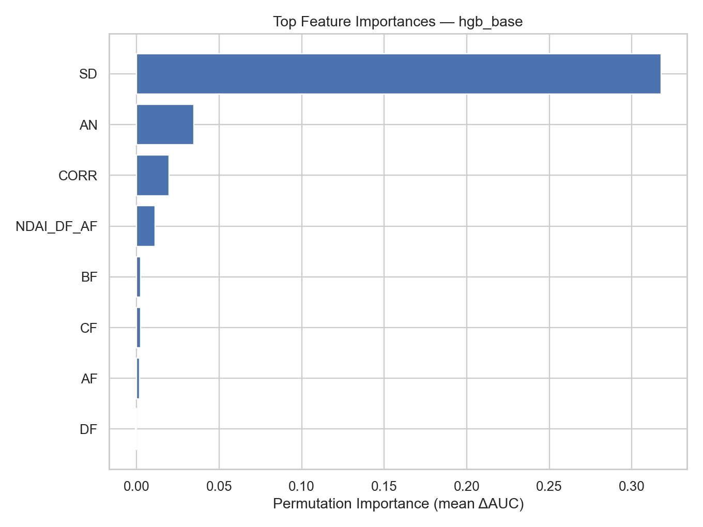

::: {.callout-note appearance="simple" icon=false}
## Project Overview

A pixel-level cloud detector trained on NASA MISR multi-angle satellite imagery of the Arctic, where standard brightness-based cloud detection fails because snow-covered ice is just as bright and just as cold as a cloud top. The headline model scores 0.9958 AUC on its held-out test image — rotate which of the three available images gets held out instead, and the same model scores as low as 0.8874. That gap, not the leaderboard, is the real finding.

Course: STAT 214: Data Analysis and Machine Learning for Real-World Decision Making · Semester: Spring 2026 · Language: Python

**[▶ Explore the interactive version](https://ricardo-pc.github.io/arctic-cloud-detection/)**: play cloud detector against the real trained model, inspect any of 115,032 real pixels on a live raster map, drag a threshold across real feature distributions, and see exactly where — and why — the model gets it wrong.

[GitHub Repository](https://github.com/ricardo-pc/stat-214/tree/main/lab2)
:::

## The Problem

Most cloud-detection algorithms lean on a simple rule: clouds are bright, the ground underneath usually isn't. That rule collapses in the Arctic. Snow and sea ice are just as reflective and just as cold as cloud tops, so a brightness threshold that works over open ocean or temperate land is close to useless here — exactly the problem NASA's Multi-angle Imaging SpectroRadiometer (MISR) was built to solve.

MISR photographs the same 275-metre patch of ground from five camera angles within minutes of each other: DF (70.5°), CF (60°), BF (45.6°), AF (26.1°), and AN, looking straight down (0°). The physics is the signal: cloud tops scatter light strongly forward, so the DF camera sees them as much brighter than the AN camera does. Flat ice and snow scatter close to uniformly across angles. The difference between camera angles carries the classification signal that raw brightness cannot.

## The Data

Three labeled MISR orbits over the same Arctic region (path 26, 2002 daylight season), spanning a full seasonal transition — late April through mid June — plus 161 additional unlabeled orbits available for unsupervised pre-training.

- ~345,000 total pixels; 207,681 carry expert cloud/not-cloud labels
- Training set: O012791 + O013257 (125,598 labeled pixels, 33.2% cloud)
- Test set: O013490, held out by date (82,083 labeled pixels, 47.8% cloud — real seasonal drift as the melt season progresses)
- Eight raw/engineered features per pixel going into the final model: the five radiances, SD (local texture), CORR (cross-angle correlation), and NDAI_DF_AF (an angular scattering ratio)

## Before Any Model: Auditing the Data

Every accuracy number in this project rests on two things I checked before training anything.

**Outlier detection.** A 3σ rule across all eight features flags 21,609 pixels (6.3%) across the three orbits. The reflex is to drop them. Instead I checked where they were — they weren't scattered randomly, they clustered on one specific coastline. That's Greenland's edge, a region with known poor cross-angle terrain registration at sharp elevation changes (Shi et al. 2008). Real sensor-geometry artifact, not noise. Retained and flagged, not dropped.

**The label buffer.** This is the finding that isn't in our submitted report. Across all three labeled orbits, every single pair of side-by-side labeled pixels shares the same label — 161,367 adjacent pairs in the test orbit, 139,631 and 107,028 in the two training orbits, zero disagreements anywhere. That's not a fact about clouds; it's a property of how the labels were drawn. Experts assigned regions, not individual pixels, and left an unlabeled buffer around every class transition — an empirical minimum of 6.0 grid units between opposite-class labels, against a theoretical grid spacing of 1.0.

The consequence: the labeled test set structurally excludes the pixels the model finds hardest. Every accuracy number in this project — and probably in the source literature — is computed on the easy pixels.

## Feature Engineering

Eight features, ranked by separability (AUC / KS statistic / mutual information, computed independently so no single metric's blind spot could inflate a feature's apparent value):

| Feature | AUC | Notes |
|---|---|---|
| SD | 0.935 | Local texture. Cloud pixels average 4.4× the SD of not-cloud pixels. |
| NDAI (textbook) | 0.823 | (DF−AN)/(DF+AN) |
| AF | 0.799 | Strongest single raw radiance angle |
| CORR | 0.524 | Barely better than chance — see below |

CORR — one of three pillars of the original Shi et al. labeling rule — is nearly useless alone on this data (AUC 0.524). It's built to catch high-altitude clouds, where cross-angle registration shift is large; these three orbits are dominated by low-altitude cloud that looks nearly identical from every angle. Kept in the final feature set anyway, since a tree-based model can use it in combination even when it contributes almost nothing alone — and permutation importance later confirms it does (0.0196), unlike the raw DF radiance, which goes measurably negative.

I also swept six ways of building an angular scattering ratio, (a−b)/(a+b), across every camera pair. `NDAI_DF_AF` (comparing DF to AF instead of AN) beat the textbook version on all three metrics and is what the selected model uses. `NDAI_AF_AN` landed at exactly 0.500 AUC — chance — because AF and AN are only 26° apart, not enough angular separation to carry any signal. A clean negative result, and useful for the same reason a positive one is.

## Transfer Learning: An Autoencoder on Unlabeled Patches

Hand-built features are defined at a single pixel; cloud is a spatially coherent thing. With 161 unlabeled orbits sitting unused, I trained a convolutional autoencoder on 9×9×8 patches (648 dims → 32-dim embedding → 648 reconstruction, MSE loss) to learn spatial texture without any labels, then fused the 32 embeddings with the eight hand-built features.

The honest result: it didn't help. Random Forest actually got worse with the embeddings added (AUC 0.9944 on 3 features down to 0.9861 on 40). HGB gained +0.0001 (0.9958 → 0.9959). The eight hand-built features already carried the signal that mattered — a real, working transfer-learning pipeline that also happens to be evidence this particular problem didn't need one.

## Why a Random Split Would Have Been a Lie

Because neighboring pixels always share a label, a random pixel-level train/test split would put a pixel in training and its immediate neighbor in test — that's not generalization, it's memorizing a map. I used a temporal holdout instead: train on the two earlier orbits, test on the later one, mirroring real deployment (score a future pass with a model trained on the past).

Then I went further. Rotating which of the three orbits gets held out (leave-one-orbit-out cross-validation — a follow-up analysis run after the report was submitted) shows what that single holdout number was hiding:

| Held-out orbit | HGB-Base (8 feat.) | HGB-Full (40 feat.) | RF-Full (40 feat.) |
|---|---|---|---|
| O012791 | 0.8874 | 0.9088 | 0.7842 |
| O013257 | 0.9739 | 0.9840 | 0.9814 |
| O013490 | **0.9958** | 0.9959 | 0.9861 |

The headline 0.9958 is the *best* of three possible holdouts, not a stable property of the model. With only three orbit groups, there's no averaging your way out of that spread — the honest error bar on this project is closer to ±0.05 AUC than the ±0.0003 seed-to-seed variance a naive robustness check would suggest.

## Results

Every tree-based model cleared 0.98 AUC; every linear model fell over once handed all 40 features.

| Model | Features | ROC AUC |
|---|---|---|
| RF (Base) | 3 | 0.9944 |
| **HGB (Base) — selected** | **8** | **0.9958** |
| HGB (Full) | 40 | 0.9959 |
| SVM (Full) | 40 | 0.4148 |
| Lasso Logistic (Full) | 40 | 0.5109 |

Three orders of magnitude of extra machinery (3 features → 40, RF → HGB) bought 0.0015 AUC. Handing the SVM the same 40 features it handled fine at 3 dropped it to 0.4148 — below chance — because margin-based models don't shrug off collinearity the way trees do.

HGB-Base (8 features) was selected over HGB-Full (40 features, 0.0001 AUC better) because the better model needs a trained autoencoder and a patch-extraction pipeline running at inference time. That trade is an engineering decision, not a leaderboard result.

{width=100%}

The confusion matrix is deliberately lopsided: 198 missed clouds against 3,017 false alarms (recall 0.9950, precision 0.9283) — a trade that fell out of class weighting, not a deliberate choice, but plausibly the right one for a downstream climate product where missing a cloud is costlier than a false alarm.

{width=85%}

Two distinct failure modes fall out of the error analysis, both traceable to specific features rather than "the model got confused": missed clouds run texture-masked (false negatives average SD = 1,376, nearly double the 706 of correctly caught clouds — the cloud's own texture disappears into an already-heterogeneous surface), while false alarms are suspiciously smooth (false positives have a median CORR of 0.909 against 0.161 for true clouds — a clear-sky surface at the right angle can register almost identically across every camera, exactly what fools that feature).

## Technologies & Tools

Core stack: Python, PyTorch (autoencoder), scikit-learn (RF, HGB, SVM, logistic regression), pandas / NumPy

Feature engineering: AUC / KS / mutual-information separability ranking, angular-ratio sweep across all camera pairs, PCA on the radiance block

Model selection: temporal holdout + 5-fold stratified CV, leave-one-orbit-out cross-validation as a follow-up robustness check

Stability checks: label-noise robustness (5% training-label flip, 3 independent repetitions), unseen-orbit sanity checks on three fully unlabeled scenes

## Links & Resources

- [Interactive walkthrough](https://ricardo-pc.github.io/arctic-cloud-detection/): the full analysis as an interactive site — play cloud detector against the real model, drag a live threshold across real feature histograms, and inspect any of 115,032 real pixels on a hoverable raster map showing raw radiances, engineered features, and the model's prediction for that exact pixel
- [GitHub Repository](https://github.com/ricardo-pc/stat-214/tree/main/lab2): full codebase, feature engineering pipeline, and autoencoder training
- [Final Report (PDF)](https://ricardo-pc.github.io/arctic-cloud-detection/report.pdf): complete write-up with methodology and results

## Reflection

The most useful finding in this project isn't in the leaderboard — it's the discovery that the labeled test set structurally excludes the pixels the model finds hardest. Nobody asked me to check whether adjacent pixels ever disagreed on their label; I checked because it seemed like the kind of thing worth verifying before trusting any accuracy number downstream. It turned out to be the single most important caveat on the whole project, and it reframes what "0.9958 AUC" actually means: not "the model is almost never wrong," but "the model is almost never wrong on the pixels we were confident enough to label."

The leave-one-orbit-out analysis made the same point from a different angle. A single holdout number is a point estimate with an invisible error bar; rotating the holdout made that error bar visible, and it was much larger than the seed-to-seed variance anyone would normally report. Between the two, I came away convinced that for a project like this, the data-quality audit and the validation design matter more than which model wins the leaderboard — the model was the easy part.

---

*Completed August 2026 as a project for STAT 214: Data Analysis and Machine Learning for Real-World Decision Making at UC Berkeley.*
