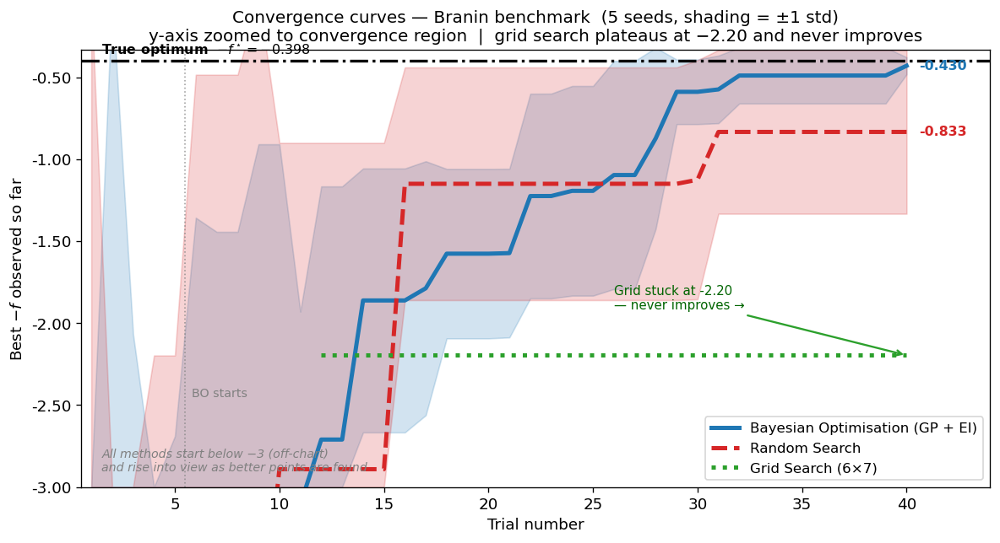
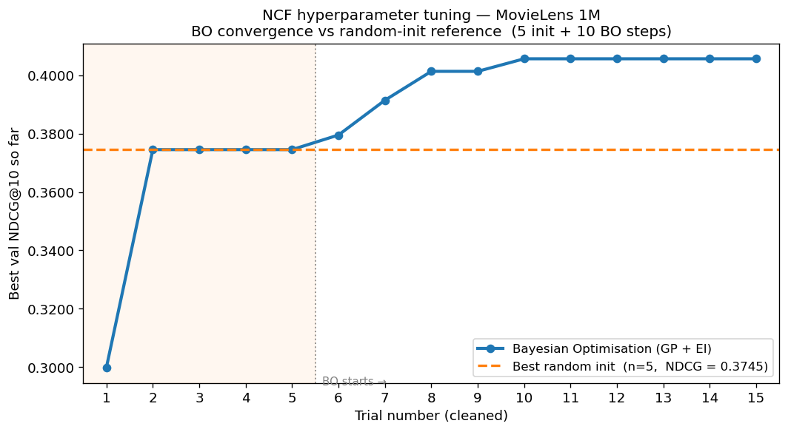
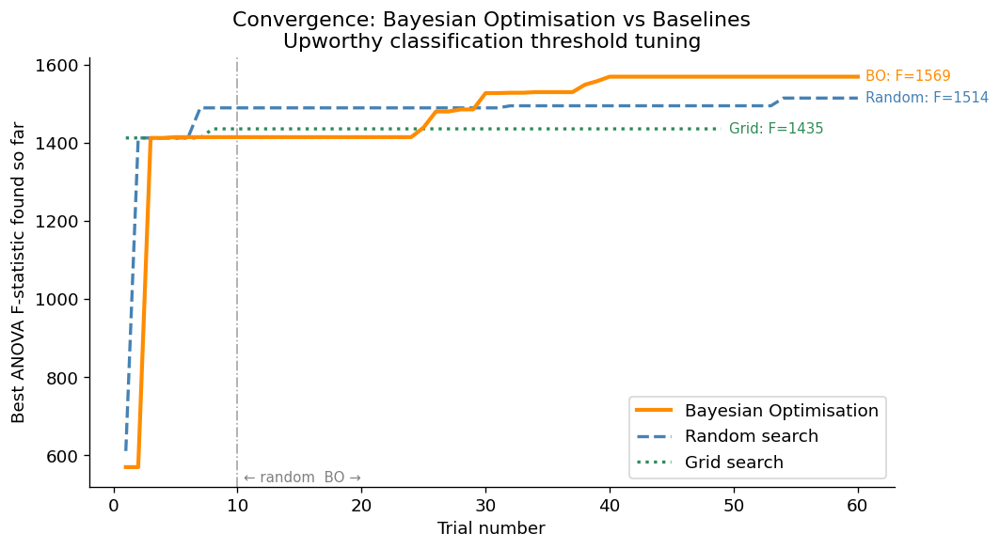

::: {.callout-note appearance="simple" icon=false}
## Project Overview

A from-scratch implementation of Bayesian Optimization using a Gaussian Process surrogate with squared-exponential kernel and Expected Improvement acquisition, applied to three experiments spanning a synthetic benchmark, neural network hyperparameter tuning, and classifier threshold optimization.

Course: STAT 238: Bayesian Statistics · Semester: Spring 2026 · Language: Python

[GitHub Repository](https://github.com/ricardo-pc/Bayesian-Optimization-for-ML)
:::

## The Problem

Tuning a machine learning model involves making a sequence of decisions under uncertainty. You pick a learning rate, train for hours, observe validation performance, and then have to decide what to try next. Grid search wastes evaluations on systematically spaced points regardless of what the results say. Random search is better, but it treats each trial independently, ignoring everything learned from previous runs.

Bayesian Optimization (BO) does something smarter: it builds a probabilistic model of the objective function from every evaluation so far, then uses that model to decide where to look next. It is the principled answer to the question of how to optimize an expensive black-box function with a tight budget.

For this project, I implemented the full BO pipeline from scratch, with no hyperopt and no optuna, and ran it on three problems with very different cost structures.

## The Method

The implementation has three components, each in its own module.

**Gaussian Process surrogate (`gp.py`).** A GP is a distribution over functions. Given observations, it produces a posterior: a mean function $\mu(x)$ (best guess at each point) and a variance function $\sigma^2(x)$ (uncertainty). The kernel is squared-exponential with three hyperparameters: output scale $\alpha$, length scale $\ell$, and noise variance $\sigma^2_n$. These are fit by maximizing the log marginal likelihood at each iteration via L-BFGS-B. Cholesky decomposition keeps the linear algebra numerically stable.

**Expected Improvement acquisition (`acquisition.py`).** EI is the expected amount by which the next evaluation will beat the current best:

$$\text{EI}(x) = (\mu(x) - f^*)\,\Phi(Z) + \sigma(x)\,\phi(Z), \quad Z = \frac{\mu(x) - f^*}{\sigma(x)}$$

The first term rewards exploitation (high predicted mean); the second rewards exploration (high uncertainty). The balance shifts automatically as the GP gains confidence, with no manual tuning of an exploration parameter.

**BO loop (`bo.py`).** Inputs are normalized to $[0,1]^d$ before each GP fit, and outputs are standardized to zero mean and unit variance. This keeps the kernel hyperparameters in comparable ranges regardless of the original scales. Each iteration fits the GP on all observations so far, maximizes EI over the input space (multi-start L-BFGS-B), evaluates the objective at the new point, and appends to the history.

## Three Experiments

### Branin Benchmark

Before running BO on real problems, I validated it on the Branin function: a classic 2D test with three known global minima at $f^* \approx 0.398$. A correct BO implementation should converge reliably across random seeds; grid search should fail when the optimum falls between grid lines.

{width=100%}

{width=85%}

### NCF on MovieLens 1M

The first real application was hyperparameter tuning for the Neural Collaborative Filtering model from my [CS 289A recommender systems project](../cs289-ranking/index.qmd). Each evaluation required training NCF for 10 epochs on an RTX 2080 Ti, costing about 22 minutes per trial. With a budget of 15 trials total (5 random initialization, 10 BO steps), there was no room to waste evaluations.

The search space was 5-dimensional: embedding dimension (4 discrete values), MLP architecture (3 options), learning rate and L2 decay (both log-encoded continuous), and WMF confidence scale (linear continuous).

{width=85%}

The configuration BO converged to was interpretable: largest embedding dimension (256), deepest MLP (four layers), minimal L2 regularization, and the smallest confidence scale. These cluster around a coherent region of parameter space, which suggests the GP genuinely learned the landscape rather than finding a lucky outlier.

### Upworthy Classifier Thresholds

The second real application came from my [STAT 230A headline analysis project](../upworthy-ab-testing/index.qmd), where I used a BART zero-shot NLI model to classify 54,956 headlines into topic categories. The classifier outputs a confidence score, and two thresholds control how those scores are used: a minimum confidence to accept a label, and a minimum category size to keep in the analysis.

The objective was maximizing the ANOVA F-statistic across 7 topic categories of log(CTR), where higher F means the categories are more statistically distinct, validating that the classification is meaningful. Each trial costs about 15 milliseconds (pure pandas + scipy, no GPU), so I could afford a full three-way comparison with 60 trials each.

{width=90%}

The BO-optimal confidence threshold was 0.256, lower than the 0.30 default I had used in the STAT 230A project. At that threshold, about 88% of headlines receive a label. Pushing the threshold higher improves per-label quality but discards too many observations, collapsing the F-statistic. The sweet spot the GP found was not obvious from inspection alone.

## Results

| Experiment | Budget | BO result | Best baseline | Gain |
|----|:--:|:--:|:--:|:--:|
| Branin (2D synthetic) | 40 trials | -0.43 | Random: -0.83 | 2x better |
| NCF hyperparameters (5D, GPU) | 15 trials | NDCG = 0.406 | Random: 0.375 | +8.3% |
| Upworthy thresholds (2D, fast) | 60 trials | F = 1,569 | Random: 1,514 | +3.6% |

One consistent observation across all three: BO's advantage is largest when the budget is tightest relative to the search space. The Branin result (2x improvement over random) reflects a 40-trial budget over a smooth 2D space where the GP can learn the landscape quickly. The NCF result (+8.3%) came from 15 trials over a 5-dimensional mixed space where each random trial burns 22 minutes. The Upworthy result (+3.6%) is smaller partly because 60 trials over a 2D smooth space is generous enough that random search also converges reasonably well.

## Technologies & Tools

Core stack: Python, NumPy, SciPy (L-BFGS-B, ANOVA), matplotlib

Implementation: GP with squared-exponential kernel, Cholesky decomposition for posterior inference, log marginal likelihood maximization for kernel hyperparameter fitting, multi-start EI maximization

Experiments: Branin benchmark (analytic), NCF black-box wrapper (subprocess CLI to PyTorch training script), Upworthy black-box wrapper (pandas + SciPy F-test)

## Links

- [GitHub Repository](https://github.com/ricardo-pc/Bayesian-Optimization-for-ML): full implementation, notebooks, and experiment results

## Reflection

The most satisfying part of this project was that the three experiments genuinely connected to each other. The NCF tuning used the BO implementation to fix hyperparameters before running the CS 289A sparsity sweep. The Upworthy threshold tuning improved the category labels used in the STAT 230A regression. Building BO from scratch stopped being a course exercise and became a tool that made two other projects better, with quantifiable improvements in both cases.

The hardest implementation detail was the input/output normalization. Mapping inputs to $[0,1]^d$ and standardizing outputs before each GP fit sounds simple, but getting it wrong causes the kernel hyperparameters to drift into bad regions and the EI surface to behave unexpectedly. The Branin simulation study was essential for catching those bugs before running on experiments that cost hours of GPU time.

---

*Completed May 2026 as a final project for STAT 238: Bayesian Statistics at UC Berkeley.*
