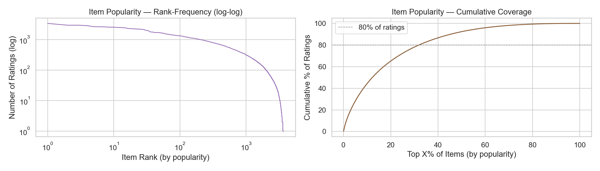
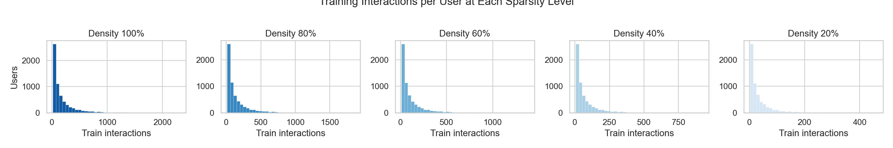

::: {.callout-note appearance="simple" icon=false}
## Project Overview

A controlled comparison of three recommender systems of increasing complexity on MovieLens 1M, retrained from scratch at five training data densities to study how sparsity shapes the bias-variance tradeoff.

Course: CS 289A: Introduction to Machine Learning · Semester: Spring 2026 · Language: Python (PyTorch)

[GitHub Repository](https://github.com/ricardo-pc/cs289-ranking)
:::

## The Question

Modern recommendation pipelines almost always have two stages. First, a fast retrieval model narrows millions of items down to a few hundred candidates. Then, a more powerful ranking model re-scores those candidates and picks the top results. It is the architecture behind what YouTube, Spotify, and Netflix serve you every day.

But does the extra ranking stage actually help? And does the answer change when training data is scarce?

That is what this project set out to test. We trained three systems of increasing complexity on the same dataset, then progressively starved them of training data to see which architecture holds up best when interactions are sparse.

## The Data

We used MovieLens 1M: one million ratings from 6,040 users across 3,706 movies, collected between 2000 and 2003. The dataset is a classic benchmark in recommender systems research precisely because it is dense enough to train on but realistic enough to be informative.

Ratings are treated as implicit feedback with confidence weighting. Rather than predicting the star rating itself, the models learn to rank items a user has interacted with above those they have not. A star rating of 5 is treated as a stronger positive signal than a 1, but both are positive. The confidence weight is $c_{ui} = 1 + \alpha \cdot r_{ui}$, where $\alpha$ is tuned per model.

{width=90%}

Data preparation followed the leave-one-out protocol from He et al. (2017): each user's last interaction (by timestamp) goes to the test set, the second-to-last to validation, and everything else to training. No user features or movie metadata were used, keeping the comparison focused on interaction structure alone.

## Three Models, Increasing Complexity

We built three systems, each a strict superset of the previous.

**Matrix Factorization (MF).** The baseline. Each user and item gets an embedding vector, and the relevance score is just their dot product passed through a sigmoid. Simple, low variance, and well understood. Loss is confidence-weighted binary cross-entropy.

**Neural Collaborative Filtering (NCF).** Same embeddings as MF, but instead of a dot product, the user and item vectors are concatenated and fed into a multi-layer perceptron (256, 128, 64, 32 hidden units with batch normalization and dropout). The idea is that the MLP can capture non-linear interaction patterns that a dot product misses.

**Two-Stage Ranker (MF + Ranker).** MF scores all items and selects the top 100 candidates. A separate ranking MLP then re-scores those 100 using Bayesian Personalized Ranking (BPR) loss, which directly optimizes for correct pairwise ordering. The MF embeddings are frozen; only the ranking head is trained in stage two.

Both MF and NCF were tuned independently with Bayesian Optimization (20 trials each, Gaussian process with expected improvement acquisition) before the sparsity sweep.

## The Sparsity Sweep

After tuning, all three models were retrained from scratch at five training data densities: 100%, 80%, 60%, 40%, and 20% of each user's training interactions. The validation and test sets stay fixed. At 20% density, roughly 9% of users have fewer than five training interactions, pushing into genuine cold-start territory.

{width=100%}

This gives 15 independent training runs total. The design is intentionally clean: same architecture, same hyperparameters, same test set, only the training density changes. Any difference in performance isolates the effect of data quantity on model complexity.

## Results

The main result is both clean and counterintuitive.

{width=100%}

On ranking quality (NDCG@10), MF wins at every density. There is no crossover point where NCF or the two-stage Ranker catches up as data grows. At full density, MF scores 0.396 vs. 0.378 for NCF and 0.376 for the Ranker. At 20% density, the gap persists: MF at 0.300, NCF at 0.280, Ranker at 0.299.

| Model           | NDCG@10 (d=1.0) | NDCG@10 (d=0.2) | HR@10 (d=1.0) | HR@10 (d=0.2) |
|-----------------|:---------------:|:---------------:|:-------------:|:-------------:|
| **MF (A)**      |    **0.396**    |    **0.300**    |   **0.677**   |     0.539     |
| NCF (B)         |      0.378      |      0.280      |     0.658     |     0.517     |
| MF + Ranker (C) |      0.376      |      0.299      |     0.657     |   **0.552**   |

The two-stage Ranker does show one partial win: at low density (d ≤ 0.4), it surpasses MF on hit rate (HR@10) by up to 1.2 percentage points. But this improvement in coverage does not come with better ranking. The Ranker is placing the correct item in the top 10 more often, but further down the list than MF does. For most applications, that distinction matters.

## Why Simple Wins

The result is surprising until you think about the structure of the data. MovieLens 1M is well described by a low-rank model: user preferences and item attributes align in a way that a dot product captures accurately. The MLP in NCF adds representational capacity, but on this dataset there is no additional non-linearity to capture. More capacity just means more variance and a harder optimization problem.

This is consistent with Rendle et al. (2020), who showed that carefully tuned MF frequently matches or outperforms NCF on standard benchmarks. The gap in our results narrows slightly at higher density (more data helps the complex models close the gap somewhat), but it never closes.

The Bayesian Optimization runs reinforce this story. MF improved 11% from its default hyperparameters, while NCF improved only 3%: NCF's defaults were already near its optimum, and MF was simply being underestimated before proper tuning.

The takeaway is not that two-stage ranking is bad. It is that its value depends on whether the data and the retrieval bottleneck actually create a re-ranking problem worth solving. On clean, moderately dense, low-rank data, a well-tuned retrieval model can be enough.

## Technologies & Tools

Core stack: Python, PyTorch, scikit-learn, matplotlib

Training infrastructure: Adam optimizer, confidence-weighted BCE (MF and NCF), BPR pairwise loss (Ranker), single NVIDIA GPU for NCF and Ranker training

Hyperparameter tuning: Bayesian Optimization with Gaussian Process (squared-exponential kernel, expected improvement acquisition, 20 trials per model)

Evaluation: NDCG@10 and HR@10 on a fixed held-out test set (leave-one-out split), 15 total training runs across the sparsity sweep

## Links & Resources

- [GitHub Repository](https://github.com/ricardo-pc/cs289-ranking): full codebase, training scripts, and notebooks
- [Final Report (PDF)](CS289_Report.pdf): complete write-up with methodology and results

## Reflection

The most useful thing this project taught me is how easy it is to assume complexity helps. The two-stage ranking pipeline is elegant: retrieval narrows the field, then a dedicated ranker polishes the output. It makes intuitive sense. But sense is not evidence, and on this dataset, with this data density, the evidence pointed the other way.

Running all 15 training runs with fixed hyperparameters and a fixed test set made the result hard to explain away. The gap was consistent across every density level, and the partial win the Ranker showed on hit rate came at no improvement in actual ranking quality. That kind of clean, controlled comparison is what makes a result believable, and designing the experiment that way was the most important decision we made.

---

*Completed May 2026 as a final project for CS 289A: Introduction to Machine Learning at UC Berkeley.*
