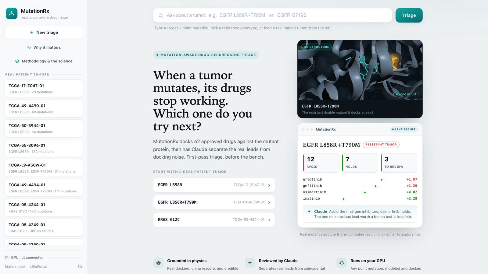

::: {.callout-note appearance="simple" icon=false}
## Project Overview

A mutation-aware drug-repurposing triage tool for translational-oncology researchers. For a tumor's driver mutation it docks a panel of approved drugs against the wild-type and mutant protein, quantifies each binding shift with a 95% credible interval, and then has Claude review every hit for mechanistic plausibility, separating believable leads from coincidental docking scores.

Event: Built with Claude: Life Sciences (Anthropic × Gladstone Institutes), Builder track · July 2026 · Stack: Python, FastAPI, Claude (Agent SDK + API), DiffDock + gnina docking, Bayesian bootstrap, MCP

[Live App](https://mutationrx.onrender.com)
:::

## The Problem

Targeted cancer drugs fail by resistance: the tumor mutates, the protein changes shape, and the drug no longer binds. Deciding what to try next, or whether some cheap already-approved drug could be repurposed for the mutant, means slow, expensive cell-based screening. There are always too many candidates and too little bench budget.

Computational docking can rank candidates cheaply, but it has a fatal flaw for this use: it happily scores drugs that have no real business binding the target. A robust docking score is not a real hit, and a bench researcher usually can't tell signal from artifact. That gap, not the docking itself, is the actual problem worth solving.

## The Approach

{width=100%}

The design thesis is one line:

> **The docking finds candidates. Claude decides which to believe.**

For a tumor's driver mutation, MutationRx docks a panel of 62 approved drugs against both the **wild-type and mutant** structure, rescores the poses, and runs a **Bayesian bootstrap over replicate docking runs** to put a 95% credible interval on each wild-type→mutant shift. Every drug lands in one of four buckets: *weakened* (resistance), *robust* (safe bet), *improved*, or *non-binder*.

Then **Claude reviews each hit for mechanistic plausibility**. This is the step a script can't do: a beta-blocker that "binds" EGFR is almost certainly an artifact, while a drug whose real mechanism fits the target is worth the assay. Remove the reviewer and you are back to an untrustworthy hit list, so the reviewer is load-bearing rather than decorative.

## Why It's Credible

Every claim the tool makes is built to be checkable:

- **It reproduces known biology on unseen real data.** Run on a genuine, de-identified TCGA lung tumor carrying EGFR L858R+T790M, it recovers the clinic from docking alone: erlotinib and gefitinib fail, and **osimertinib holds**, on a single patient tumor it had never seen.
- **It shows why statistics alone aren't enough.** Screening 300 approved drugs against the resistant mutant, docking plus bootstrap flagged ten as significantly *improved* binders with tight credible intervals, and every one is a mechanistic artifact (antidepressants, antipsychotics, antibiotics). Only mechanism separates them, which is exactly the judgment Claude adds.
- **The reviewer's judgment is grounded, not asserted.** Each drug carries two orthogonal evidence axes the docking never sees: **pathway grounding** (is the drug's real target in the driver's pathway or enzyme class?) and **DepMap dependency** (is that target a gene lung adenocarcinoma actually needs, from CRISPR essentiality?). On-target inhibitors corroborate on both; the statin and antidepressant artifacts fail both. That turns the artifact-vs-lead call into an auditable, cited read rather than a black-box assertion.
- **It flags its own blind spots.** Docking affinity is a proxy, not efficacy; repurposing hits are hypotheses; and non-covalent docking can't capture covalent mechanisms (KRAS G12C, osimertinib on C797S), so those cases are labeled as blind spots, never read as findings.

## The Non-Obvious Lead, and the Overnight Test

Two moments show the pipeline doing its job. First, the reviewer surfaced a credible, non-obvious lead: **imatinib**, the leukemia (CML) drug, is predicted to *gain* binding across every EGFR mutant tested. Pooling the replicate evidence across four mutant structures gives a mean gain that clears both statistical and practical-significance floors, and it survives review where the statin artifacts don't, because imatinib is a kinase inhibitor and docking it against a kinase is legitimate. Strictly a hypothesis worth an assay, never a finding.

Second, to prove the tool outlasts the week, I modeled and docked **EGFR C797S**, the mutation that defeats osimertinib itself and a genotype the tool had never seen, overnight on Berkeley's GPU cluster. The tool did two honest things at once: it added a fourth consistent data point to the imatinib hypothesis, and it flagged its own limitation, warning not to read osimertinib as "still working" because C797S removes the cysteine that osimertinib binds covalently. A tool that knows where it fails is more trustworthy than one that always answers.

## Technologies & Tools

Triage engine: Python, DiffDock + gnina for docking and rescoring, NumPy for the Bayesian-bootstrap credible intervals over replicates

Claude: the Agent SDK and API power the plausibility reviewer; the whole tool was built with Claude Code

Web app: FastAPI backend with a staged background-job runner, a single-page workspace, a grounded per-result chat, and a vendored NGL 3D structure viewer (wild-type ↔ mutant, offline)

Interfaces: a hosted web app, a CLI, and an **MCP server** so Claude Code / Desktop can call the triage tools directly

Data: real de-identified TCGA lung tumors via the open-access cBioPortal API, structures from RCSB PDB, and drug chemistry from PubChem / ChEMBL with RDKit

## Reflection

The interesting problem wasn't running a docking pipeline, since those exist. It was designing around the fact that docking is an unreliable proxy, and turning that unreliability into the thing the product solves. The scarce, valuable step is the mechanistic judgment about which computational hits to believe, and that maps almost exactly onto what a language model with grounded evidence can do and a script cannot. Building for a named user, a bench researcher rather than a computational biologist, forced every result to be honest by construction: uncertainty on every call, hypotheses labeled as hypotheses, and blind spots flagged rather than hidden.

---

*Built with Claude for the "Built with Claude: Life Sciences" hackathon (Anthropic × Gladstone Institutes), July 2026.*
