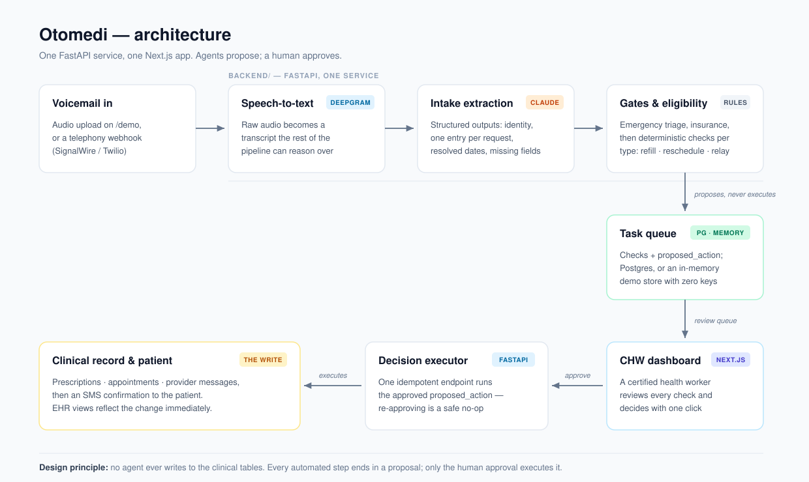

::: {.callout-note appearance="simple" icon=false}
## Project Overview

An end-to-end agent system built in 36 hours at the UC Berkeley AI Hackathon (June 2026), then rebuilt solo afterwards into the version linked here. Voicemails left at a clinic front desk are transcribed, structured by Claude, verified by deterministic eligibility services, and surfaced in a dashboard where a certified healthcare worker approves each action with one click.

Event: UC Berkeley AI Hackathon · June 2026 · Stack: Python, FastAPI, Claude API, Deepgram, Next.js, Supabase, GitHub Actions

[Live demo](https://otomedi.vercel.app) · [GitHub repository](https://github.com/ricardo-pc/otomedi) · [original hackathon repo](https://github.com/ricardo-pc/Berkeley-AI-Hackathon)
:::



## The Problem

By the end of a day at a hospital front desk, tens or hundreds of missed calls have piled up. Listening to every voicemail, writing down what the patient needs, and executing the request is slow, and the majority of those calls are one of just three things: a prescription refill, a schedule change, or a message for the doctor. Each one takes a series of clicks and lookups that lasts longer than the action itself.

Otomedi turns that voicemail backlog into a dashboard of pre-verified, one-click approvals. Repetitive requests get automated up to the point of human sign-off; edge cases are organized and surfaced for manual review instead of getting lost in an inbox.

## How It Works

{width=100%}

A voicemail flows through a pipeline of specialized agents, each with a single job:

1. **Intake Agent**: receives the Deepgram speech-to-text transcript and uses Claude to extract structured data: patient identity, insurance plan, and a `requests` array (a single voicemail can contain multiple workflow items, e.g. a refill *and* a message relay). Relative dates like "next Tuesday" are resolved to absolute dates at this stage, and missing fields are flagged explicitly.
2. **Triage Sentinel**: scans for emergency signals. Anything urgent bypasses automation entirely and escalates immediately.
3. **Eligibility Agents**: verify the request against patient records: insurance acceptance, refill eligibility (visit history, dosage match, conflicting medications), or scheduling constraints, depending on request type.
4. **Scheduling Agent**: finds an appointment slot given provider availability and urgency, writing a proposed action rather than a final one.
5. **Human approval**: a certified healthcare worker reviews the proposed action in the dashboard. Only after they click Approve does the backend execute it.
6. **Confirmation & Summary Agents**: send SMS confirmations to the patient and compile a daily digest for the front desk.

The agents don't message each other directly. Typed payloads move through one FastAPI service, while each final set of checks and its proposed action is persisted on a shared task row. That row makes the human review boundary observable, testable, and auditable.

## Designed Around Safety

The most important design decisions were about what *not* to automate:

- **Emergencies bypass automation entirely.** The triage sentinel runs before any workflow logic, and an urgent signal short-circuits the whole pipeline into human escalation.
- **No clinical action executes without human sign-off.** Agents can parse, verify, and propose, but the write to prescriptions, appointments, or messages only happens after a healthcare worker approves it.
- **Regression tests pinned to specific scenarios.** Per our mentor's guidance, each agent ships with tests for named failure cases (garbled audio, missing fields, conflicting medications), not just happy paths.

## Technologies & Tools

Agents & backend: Python, FastAPI, Claude API for extraction and verification, Deepgram for speech-to-text

Frontend: Next.js dashboards: a CHW approval dashboard, a demo EHR, and an audio-upload demo

Data: Supabase (Postgres) as the shared task store and system of record for patients, visits, prescriptions, and schedules

## The Post-Hackathon Rebuild

The hackathon demo stopped working about a week after the event: it spanned five separately deployed pieces (two Python services, three Next.js apps) across free-tier hosts, and the first one to lapse took the rest down with it. The rebuild treated that as the main lesson rather than an embarrassment:

- **One backend, one web app.** The two Python services — split along team boundaries, with intentionally duplicated logic — became a single FastAPI service; the three Next.js apps became one, with the dashboard, the [pipeline demo](https://otomedi.vercel.app/demo), and the EHR mock as routes. The test suite stayed green through the merge.
- **A demo that cannot die.** With no credentials configured, the backend swaps its Supabase repositories for in-memory adapters behind the same interface, and the web app falls back to an in-repo seed. The [hosted demo](https://otomedi.vercel.app) is a static-hosting deployment with zero environment variables — nothing left to auto-pause.
- **Structured outputs and a pinned eval.** Intake extraction moved from parse-the-markdown-fences to Claude structured outputs, with format enforcement in a JSON schema instead of prompt prose. An eval harness scores the extractor field-by-field on ten canonical voicemail transcripts against pinned expected outputs.
- **The pipeline made visible.** [/demo](https://otomedi.vercel.app/demo) now starts with a self-running cached scenario — no file upload required — showing the transcript, extracted fields, every eligibility rule's verdict (including a drug-interaction *warning* that deliberately doesn't block), the human review boundary, and the final clinical write.

174 regression tests run in CI on every push.

## Reflection

The interesting engineering problem wasn't getting an LLM to read a voicemail. It was deciding where automation must stop. Healthcare punishes false confidence, so the architecture treats the human approval click as a first-class pipeline stage rather than an afterthought. Structuring agent communication through a shared database row, instead of direct agent-to-agent messages, is what made the system debuggable at hackathon speed: every intermediate decision was inspectable in one table. The rebuild added a second lesson: a portfolio demo is a distributed system with an uptime requirement and no on-call rotation, so it has to be designed to degrade — the version that survives is the one that needs nothing to stay alive.

---

*Built at the UC Berkeley AI Hackathon, June 2026.*
