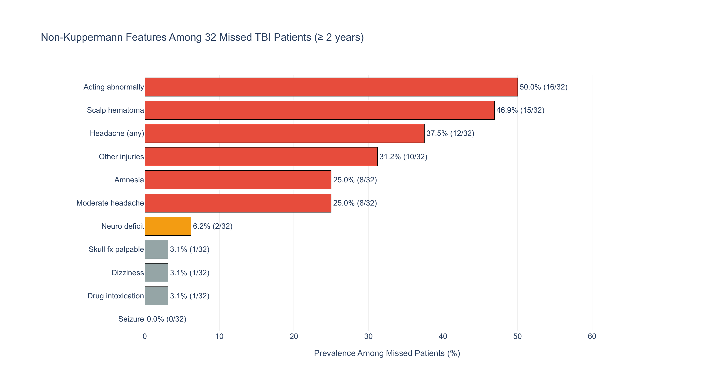
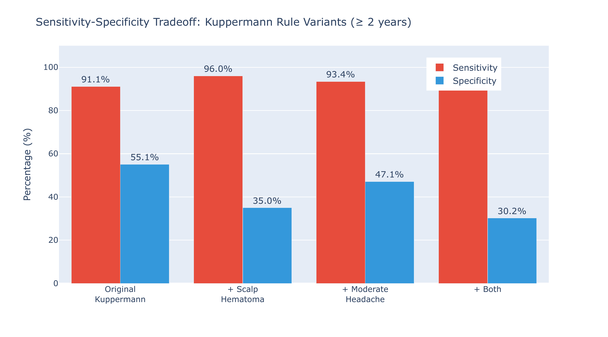

::: {.callout-note appearance="simple" icon=false}
## Project Overview

On 43,399 pediatric head trauma patients, a random forest cuts unnecessary CT scans by 63% against the standard Kuppermann clinical rule while holding the same 84.2% sensitivity. Getting there took a full analysis of the PECARN dataset, from cleaning and exploratory analysis through Bayesian symptom posteriors to classification modeling, all aimed at one question: when should a child with a head injury get a CT scan?

Course: STAT 214: Data Analysis and Machine Learning for Real-World Decision Making · Semester: Spring 2026 · Language: Python

[GitHub Repository](https://github.com/ricardo-pc/stat-214/tree/main/lab1)
:::

## Background

Traumatic brain injuries (TBI) are a leading cause of death in patients younger than 18. CT scans are the standard diagnostic tool, but radiation exposure in childhood increases cancer incidence, so unnecessary scans carry real risk. The clinical challenge is identifying the small fraction of children (under 1%) with clinically-important TBI (ciTBI) while sparing the rest from unnecessary radiation.

The Kuppermann rule (2009) is the standard clinical decision rule used in practice: a short checklist of binary symptoms where any positive flag triggers a CT recommendation. It achieves near-perfect sensitivity but low specificity, meaning it catches almost every true TBI case but recommends CT for a large number of children who don't need one.

This lab investigates: *Can we do better?*

## The Data

The PECARN dataset comes from a multi-center prospective cohort study conducted across 25 emergency departments between 2004 and 2006. It contains 43,399 patients and 125 clinical features.

::: {.callout-tip appearance="default" icon=false}
## Dataset Highlights

43,399 patients enrolled across 25 emergency departments

125 features spanning injury mechanism, symptoms, GCS scores, neurological signs, and demographics

0.89% ciTBI prevalence, with only 376 positive cases out of 42,047 after exclusion criteria

Final analysis dataset matches the Kuppermann et al. study population
:::

Data cleaning covered column renaming, type enforcement, missingness quantification, duplicate checks, range validation, and consistency checks. All steps were documented against the original data dictionary.

## Key Findings

### Finding 1: Missed Patients Are Not Asymptomatic

The Kuppermann rule achieves 100% sensitivity for children under 2, but misses 32 of 278 TBI cases (11.5%) in children aged 2 and older. These 32 patients have none of the features the rule checks for that age group, but that does not mean they were healthy-looking. Only 3 of the 32 (9.4%) had zero non-Kuppermann clinical features. The rest presented with identifiable symptoms the rule simply ignores for older children:

- 50% were not acting normally
- 46.9% had a scalp hematoma
- 37.5% reported headache of any severity
- 25% had moderate headache (the rule flags only *severe* headache)

Scalp hematoma and acting abnormally are both used by Kuppermann for children under 2 but dropped for older children. Their prevalence among missed patients suggests these features carry predictive value across age groups, a gap a learned model could exploit.

{fig-align="center" width="90%"}

### Finding 2: Sensitivity-Specificity Tradeoff

A natural response to Finding 1 is to add those features to the rule. The results illustrate the core limitation of binary OR-rules:

- Adding scalp hematoma recovers 13 more TBI cases but flags 6,264 additional non-TBI children
- Adding moderate headache recovers 8 more but flags 2,451 additional
- Adding both recovers 18 more but requires 7,786 additional CT scans, dropping specificity from 55.1% to 30.2%

The improvement has to come from a model that learns to weight combinations of features, not one that simply ORs more flags together. This motivated the logistic regression and random forest approaches in the modeling section below.

{fig-align="center" width="80%"}

### Finding 3: Bayesian Symptom Posteriors

Starting from a prior $P(\text{TBI}) = 0.0089$ (the 0.89% base rate in the dataset), I computed the posterior probability of TBI given each observed symptom $s$ using Bayes' theorem:

$$P(\text{TBI} \mid s) = \frac{P(s \mid \text{TBI}) \cdot P(\text{TBI})}{P(s)}$$

The key quantity for comparing symptoms is the Bayes factor, which measures how much observing a symptom shifts the odds of TBI relative to the prior:

$$\text{BF}_s = \frac{P(s \mid \text{TBI})}{P(s \mid \text{no TBI})}$$

A Bayes factor of 1 means the symptom is uninformative. A value of 20 means the posterior odds are 20 times the prior odds. This is clearest in the log-odds representation, where the update is additive:

$$\underbrace{\log \frac{P(\text{TBI} \mid s)}{P(\text{no TBI} \mid s)}}_{\text{posterior log-odds}} = \underbrace{\log \frac{P(\text{TBI})}{P(\text{no TBI})}}_{\text{prior log-odds}} + \underbrace{\log \text{BF}_s}_{\text{evidence}}$$

This framing makes the incremental diagnostic value of each symptom explicit and independent of the base rate, which matters here because the 0.89% prevalence makes all raw posteriors look small.

The results reveal a sharp two-tier structure:

| Symptom | $P(s \mid \text{TBI})$ | $P(s)$ | $P(\text{TBI} \mid s)$ | Bayes Factor |
|---|:---:|:---:|:---:|:---:|
| Palpable skull fracture | 6.6% | 0.4% | 15.6% | 20.5 |
| Basilar skull fracture | 10.9% | 0.7% | 14.3% | 18.5 |
| Altered mental status | 59.6% | 13.0% | 4.1% | 4.7 |
| Seizure | 4.5% | 1.2% | 3.4% | 3.9 |
| Loss of consciousness | 30.9% | 10.5% | 2.6% | 3.0 |
| Vomiting | 30.9% | 13.2% | 2.1% | 2.4 |
| Scalp hematoma | 61.2% | 39.8% | 1.4% | 1.5 |
| Headache | 43.4% | 30.2% | 1.3% | 1.4 |
| Acting normally | 33.2% | 78.1% | 0.38% | 0.4 |

The most striking pattern is that diagnostic power is determined by rarity, not by prevalence among TBI cases. Palpable skull fracture appears in 6.6% of TBI patients but only 0.4% of all patients, yielding a Bayes factor of 20.5. Scalp hematoma appears in 61.2% of TBI cases but has a population base rate of 39.8%, which dilutes its posterior to 1.4% and a Bayes factor of only 1.5. The difference between these two symptoms is almost entirely explained by $P(s)$ in the denominator, not by $P(s \mid \text{TBI})$.

Acting normally is the only symptom with a Bayes factor below 1 (BF = 0.4), meaning its presence *reduces* the posterior probability of TBI. In log-odds terms, observing it subtracts $\log(0.4) \approx -0.92$ from the prior log-odds, a moderately protective signal.

A bootstrap stability check (1,000 resamples of the full dataset) confirmed that the symptom ranking is stable, though rare symptoms carry substantial estimation uncertainty. The 95% CI for palpable skull fracture spans [13.1, 30.2], reflecting the fact that only 0.4% of patients present with it. Common symptoms are estimated precisely: scalp hematoma has a 95% CI of [1.4, 1.7].

An important caveat is that this analysis treats symptoms as independent. In practice they are not: among TBI-positive patients, scalp hematoma co-occurs with nearly every other symptom at rates above 60%, and altered mental status co-occurs with loss of consciousness in over a third of cases. These rates far exceed independence assumptions, which means that simply multiplying Bayes factors across symptoms would overcount evidence. Capturing these dependencies is part of what motivates the multivariate models in the next section.

## Modeling

Three models were trained on a stratified 70/15/15 train/validation/test split, all evaluated on the same held-out test set ($n = 6{,}307$). The 112:1 class imbalance was addressed with balanced class weights throughout.

### Model Comparison

| Metric | Kuppermann Rule | Logistic Regression | Random Forest |
|---|:---:|:---:|:---:|
| Sensitivity | 91.2% | 84.2% | 84.2% |
| Specificity | 43.9% | 72.7% | 79.0% |
| Unnecessary CTs | 3,506 | 1,707 | 1,312 |
| Missed TBI Cases | 5 | 9 | 9 |
| AUC-ROC | N/A | 0.857 | 0.874 |

The three models trace a clear tradeoff. The Kuppermann rule catches the most TBI cases (91.2% sensitivity) but recommends CT for over half the non-TBI patients. Logistic regression cuts unnecessary scans by 51% relative to Kuppermann, and the random forest reduces them by 63%, with both matching at 84.2% sensitivity.

Logistic regression feature coefficients confirmed the EDA findings. The top positive predictors were injury severity ($\hat{\beta} = +0.53$), scalp hematoma ($\hat{\beta} = +0.50$), and altered mental status ($\hat{\beta} = +0.49$), with acting normally as the strongest protective feature ($\hat{\beta} = -0.46$). Scalp hematoma receiving the second-highest coefficient despite being excluded from the Kuppermann rule for children aged 2 and older is consistent with Finding 1.

Bootstrap stability analysis (200 resamples) showed that the Kuppermann rule is the most stable, while the random forest has more variance in sensitivity across resamples, reflecting the greater flexibility of tree-based learning from finite training data.

## Technologies & Tools

Core stack: Python, pandas, NumPy, scikit-learn, matplotlib, seaborn

Statistical methods: Bayesian posterior inference with bootstrap confidence intervals, PCA, stratified train/val/test splitting, threshold optimization on the validation set

## Links & Resources

- [GitHub Repository](https://github.com/ricardo-pc/stat-214/tree/main/lab1): full code, notebooks, and report

## Reflection

This lab made concrete a tension that is easy to state but hard to internalize: in high-stakes classification, the right model depends on what you are optimizing for. A 91% sensitivity rule that sends 3,500 children to unnecessary CT scans is not obviously better or worse than an 84% sensitivity model that reduces that number to 1,300. That tradeoff depends on how you weigh radiation risk against missed diagnoses, which is a clinical and ethical judgment, not a statistical one.

The EDA finding that missed patients are not asymptomatic was the most satisfying result. It meant the 32 children were not random noise beyond any model's reach, but a structured subset the Kuppermann rule was never designed to catch. That kind of gap, visible only after careful data exploration, is exactly what motivates moving beyond fixed decision rules toward learned models.

---

*Completed March 2026 as Lab 1 for STAT 214 at UC Berkeley.*
