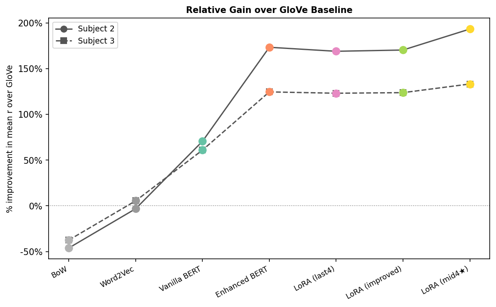
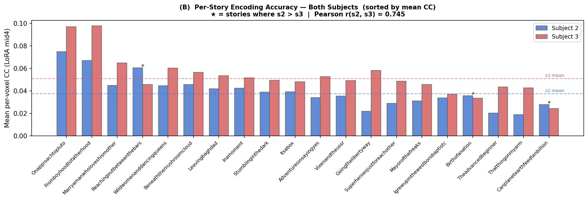

::: {.callout-note appearance="simple" icon=false}
## Project Overview

A ridge-regression brain-encoding pipeline that predicts fMRI voxel responses to spoken stories from eight text embeddings, starting from a plain word-count baseline and ending on a podcast-fine-tuned, LoRA-adapted BERT. The best configuration beats a GloVe baseline by 193% on one subject and 133% on the other. The single biggest jump in the whole project came from an unglamorous change: reading BERT's middle four layers instead of its last four.

Course: STAT 214: Data Analysis and Machine Learning for Real-World Decision Making · Semester: Spring 2026 · Language: Python · Team of 4 · Code: private course repository

**My role.** I set the project architecture and built the ridge-regression framework that every embedding method in this post ran through, including the SVD solver that makes per-voxel regularization search cheap at close to 95,000 voxels per subject. I also built the Enhanced BERT embedding stage. The LoRA fine-tuning, the SHAP and LIME interpretation, and the cross-subject stability analysis below came from my teammates Gongyao Xu, Chun-Kai Hsu, and Shizhe Zhang. I'm walking through their results here too, because the pipeline I built is what those results ran on, and the layer-depth finding only exists because of it.
:::

## Background

The question is simple to state and hard to answer: if you know what words someone just heard, can you predict how their brain responded? Prior work out of the Huth Lab (Jain and Huth, 2018) showed the answer is yes, at least partially, using ridge regression to map text features onto fMRI signal. What's less settled is which text representation to use. A word can be a raw count, a static vector, or a context-sensitive embedding pulled from a specific layer of a language model, and that choice changes what the resulting model can and can't predict.

We used data from the Huth Lab at UT Austin: two people, labeled s2 and s3, listening to 101 podcast stories inside an fMRI scanner, split into 81 training stories and 20 held-out test stories. Subject s2 has 94,251 cortical voxels; s3 has 95,556. For each subject we fit an independent ridge regression per voxel, mapping delay-stacked text embeddings onto that voxel's blood-oxygen response, then scored the fit by Pearson correlation on the held-out stories.

## The Pipeline I Built

Two things happen before any model gets fit. Words arrive at roughly 2 to 4 per second, while the scanner samples once every 2 seconds, so every embedding first gets resampled onto that grid with Lanczos interpolation. Then, because the brain's blood-oxygen response to a word lags by 4 to 6 seconds and that lag isn't fixed, I stack four time-shifted copies of each embedding, at delays of 1, 2, 3, and 4 scanner intervals, instead of picking one delay and hoping it's close enough. That quadruples the feature count, but it lets the ridge model learn its own delay filter for every voxel straight from the data.

Fitting a separate ridge regression for tens of thousands of voxels, across eight embedding methods and two subjects, adds up to a lot of regressions. The part I'm proudest of here is the solver. Instead of re-inverting $(X^\top X + \lambda I)$ for every candidate $\lambda$, I take the thin SVD of the training design matrix once and reduce each new $\lambda$ to an $O(r)$ diagonal rescale. Per-voxel regularization search, which would otherwise be too slow to run at this scale, comes essentially for free. The one representation this trick doesn't work for is bag-of-words: its roughly 48,000-dimensional, 99.99%-sparse matrix breaks a dense SVD, so that one gets a sparse LU solve instead, with a single $\lambda$ chosen from a random sample of 200 voxels.

## Eight Ways to Represent a Word

We tested eight embedding configurations across five families: a bag-of-words count vector over a roughly 12,000-word vocabulary, Word2Vec and GloVe (both 300-dimensional, pretrained on large web and news corpora), and four variants built on `bert-base-uncased`. The plain BERT baseline splits each story into independent 128-word chunks, so words near a chunk boundary get no context from what comes after it. Enhanced BERT, the piece I built, instead uses overlapping 256-word sliding windows and averages the last four transformer layers, giving every word richer context from both directions. The three LoRA variants build on a version of BERT that Shizhe fine-tuned on the podcast transcripts themselves using masked language modeling; they differ only in training recipe and in which layers get read out at inference time.

## Results

Contextual embeddings beat static ones by a wide margin, and that margin is bigger than the gap between any two contextual training recipes. Mean per-voxel correlation, averaged across both subjects:

| Method | Mean r (s2) | Mean r (s3) |
|---|---:|---:|
| BoW | 0.0069 | 0.0137 |
| Word2Vec | 0.0124 | 0.0231 |
| GloVe | 0.0128 | 0.0219 |
| Vanilla BERT | 0.0218 | 0.0353 |
| Enhanced BERT | 0.0349 | 0.0493 |
| LoRA BERT (last4) | 0.0343 | 0.0489 |
| LoRA BERT (improved) | 0.0345 | 0.0491 |
| **LoRA BERT (mid4)** | **0.0374** | **0.0512** |

Every number in that table looks small on its own. fMRI is noisy, and most of the cortex isn't doing language processing at all, so a correlation of 0.05 in a language-responsive voxel is a real signal, not a rounding error. What matters more than any single row is the size of the jumps between rows. Enhanced BERT over vanilla BERT is a 60% gain on s2 and a 40% gain on s3, just from giving the model overlapping context and averaging four layers instead of one. Almost everything else in the table barely moves.

{width=90%}

Then Shizhe found something that shouldn't have mattered as much as it did. Reading the fine-tuned BERT's last four layers, the ones closest to its training objective, instead of its middle four gave almost nothing over Enhanced BERT: a 1.7% drop on s2, effectively no change on s3. Switching to the middle four layers instead, layers 5 through 8, while keeping everything else fixed, produced the single largest jump anywhere in the hierarchy: 9.1% on s2, 4.7% on s3, for a total of 193% and 133% over the GloVe baseline. The Spearman rank correlation between which voxels each variant predicts well drops from about 0.98 between two last-four variants to about 0.87 to 0.91 between last-four and middle-four. That gap means this isn't a small tweak; layers 5 through 8 are picking out a genuinely different, more brain-relevant set of voxels than layers 9 through 12.

The likely reason is that BERT's top layers get progressively reshaped by their training objective, predicting masked words, into something closer to a lexical-prediction score than a general semantic representation. The middle layers still carry phrase structure and compositional meaning, and that seems to line up better with how association cortex actually processes language. Every step in this eight-method hierarchy but one is statistically significant at p < 10⁻¹⁵ on a paired Wilcoxon test across all voxels.

## Checking Whether It Generalizes

Two subjects is a small sample for claiming anything definitive about how brains process language, so the last piece of the project checks whether the pattern above replicates across s2 and s3 rather than being an artifact of one person's scan session.

At the story level, the two subjects' 20-story correlation profiles agree at r = 0.745: stories that are easy to predict for s2 are also easy for s3, and the hard ones line up too. s3 beats s2 on 17 of the 20 test stories; the three reversals look like ordinary individual variation rather than anything systematic.

{width=90%}

The check I find more convincing is what happens to the gap between subjects as the embeddings improve. Under BoW, s3's mean correlation is 1.99 times s2's. Under the best model, that ratio shrinks to 1.37. If the model were fitting noise specific to one subject, a better embedding wouldn't systematically close that gap; it would just make both subjects' numbers bigger or smaller at random. Watching the ratio shrink as the embeddings get richer is what makes the layer-depth finding look like a real property of language processing rather than a fluke in one person's data.

## What's Actually Driving the Predictions

Gongyao and Chun-Kai ran the interpretability half of the project: closed-form SHAP on the linear ridge weights, fast but precise only down to the 2-second scanner window, and LIME with word-level masking, slower but precise to individual words, on the 256 best-predicted voxels for two test stories. One story follows the New Horizons spacecraft's flyby of Pluto; the other follows a family's living arrangement.

Both methods land on the same content independently, which is the part worth noting. For the space story, SHAP flags a scanner window dense with time markers ("year," "old," "five"), and LIME's word-level scores independently pick out "july," "fourth," and "horizons," the exact vocabulary of the mission timeline. For the family story, SHAP's top window is a cluster of physical-scene nouns ("wooden," "chair," "propped"), and LIME's top contributors across the two subjects' voxels are relational and spatial words like "together," "live," and "door." Neither method was told what the other found. That two very different attribution techniques converge on the same passages is reasonable evidence that the model is tracking real narrative content, not an artifact of how either method works.

## Reflection

The finding I keep coming back to isn't the leaderboard number, it's how little the fine-tuning itself mattered next to which layers got read out afterward. Domain-adapting BERT on podcast transcripts and then reading the same layers as before bought almost nothing. Reading four different layers off that exact same fine-tuned checkpoint bought the single biggest gain in the project. That's a strange result, and it says something uncomfortable about how many "fine-tuning helps" claims in NLP might actually be "layer selection helps" claims wearing a fine-tuning label.

On the engineering side, the piece I'd point to as my actual contribution is the SVD reformulation of ridge regression. A naive per-voxel grid search over roughly 95,000 voxels, eight embedding methods, and two subjects would have meant refitting a large linear system tens of millions of times. Precomputing the SVD once per representation and reducing each new $\lambda$ to a diagonal rescale is what made per-voxel regularization tractable at all, and it's the piece of infrastructure the rest of the team's results are sitting on.

## Related Projects

- [PECARN Traumatic Brain Injury Analysis](../stat214-lab1/index.html): Lab 1 for the same course
- [Cloud or Ice: Arctic Cloud Detection](../arctic-cloud-detection/index.html): Lab 2 for the same course

---

*Completed May 2026 as Lab 3 for STAT 214 at UC Berkeley, with Gongyao Xu, Chun-Kai Hsu, and Shizhe Zhang.*
