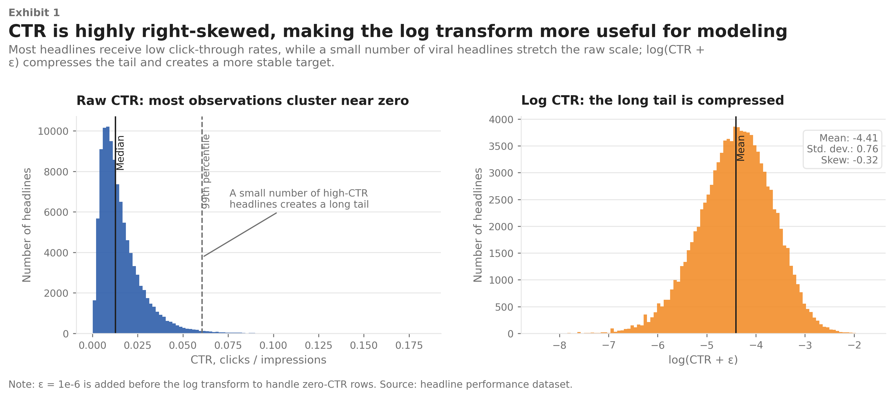

::: {.callout-note appearance="simple" icon=false}
## Project Overview

A regression analysis of the Upworthy Research Archive: 54,956 headline packages across 11,649 formally controlled A/B tests, asking which headline features predict click-through rate and how to estimate those effects correctly when observations are clustered within the same experiment.

Course: STAT 230A: Linear Models · Semester: Spring 2026 · Language: Python

[GitHub Repository](https://github.com/ricardo-pc/upworthy-ab-testing)
:::

## The Setup

Between 2012 and 2019, Upworthy ran one of the largest natural headline experiments in digital media history. Every article was tested with two to six different headlines shown simultaneously to random audience subsets. The winner went live. The rest were archived.

That archive is now public. It contains over 100,000 headline variants across more than a decade of A/B tests, each with an exact impression count and click count. It is, in effect, a massive dataset where the outcome of interest (click-through rate) was measured under controlled conditions.

The question I wanted to answer: beyond any one headline being better than another, are there systematic patterns? Do certain structural or linguistic features consistently predict more clicks, regardless of topic?

## The Data

The final analysis dataset covers 54,956 headline packages from 11,649 A/B tests between 2013 and 2015. Three cleaning steps shaped it:

- Single-variant tests were dropped (no competitor means no comparison).
- Tests where the image varied across packages (~35% of raw data) were excluded, since image differences confound headline effects.
- A Cloudflare misconfiguration in late 2013 corrupted impression counts for some tests; affected rows were removed.

Raw click-through rate is badly skewed: most headlines receive a 1–3% CTR while a handful go viral and pull the mean up. The outcome variable is log-transformed CTR, which compresses the tail and makes regression coefficients interpretable as proportional changes: a coefficient of 0.06 means roughly +6% more clicks.

{width=95%}

## Fourteen Features

Each headline was characterized by 14 features covering structure, rhetoric, sentiment, and readability:

- **Rhetorical devices:** ends with "?", has "!", has "...", starts with how/why/what, contains "you/your", contains "we/our"
- **Numeric content:** starts with a digit, contains any digit, has a superlative word
- **Sentiment:** VADER compound score, ranging from −1 (most negative) to +1 (most positive)
- **Length:** character count, word count, average word length

The features are deliberately surface-level — no embeddings, no LLM scoring. The goal was to isolate the predictive value of things an editor can control in seconds: punctuation, framing, and word choice. VADER was chosen for the same reason: it requires no training and produces a reliable sentiment estimate from a lexicon, making results interpretable rather than opaque.

## The Estimation Problem

A standard OLS regression would understate uncertainty here. Each A/B test contains multiple packages that share the same article, the same publication window, and the same audience pool. Packages within the same test are correlated in ways OLS ignores.

To handle this, I built four model variants in sequence:

1. **OLS baseline** — establishes the coefficient estimates but produces overconfident standard errors
2. **HC3 heteroskedasticity-robust SEs** — corrects for variance differences across packages; the ratio to OLS SEs is 0.95–1.03, confirming heteroskedasticity is minor
3. **Cluster-robust SEs** — allows arbitrary error correlation within each test (11,649 clusters); the ratio to OLS SEs is 1.3–2.2, confirming clustering is the dominant issue
4. **WLS with cluster-robust SEs** — downweights packages with few impressions (where CTR is noisiest); used as a robustness check

All ten statistically significant features retain their sign and significance across all four specifications. The coefficient estimates are stable; only the confidence intervals change.

## What I Found

{width=100%}

The clearest finding is the one the chart title says outright: exclamation marks are the single biggest negative predictor. Headlines with "!" have substantially lower CTR than otherwise equivalent headlines, with the coefficient putting the effect in the range of a 30% relative reduction. Collective framing ("we/our") is the second-largest suppressor, followed by question marks and curiosity-gap openers ("how/why/what").

On the positive side, numeric content wins. Headlines starting with a digit and headlines containing any number both show reliable positive effects. "Has superlative word" is also positive and significant, though smaller.

Sentiment tells a counterintuitive story. The VADER score has a negative coefficient: more *positive* sentiment predicts more clicks. Readers, at least in this sample, responded better to emotionally neutral or affirmative frames than to alarming or negative ones. This runs counter to the usual claim that negative news spreads better, though the effect here is associational rather than causal.

| Feature | Direction | Approx. effect on CTR |
|----|:--:|:--:|
| Has "!" | Negative | ~30% lower |
| Contains "we/our" | Negative | ~22% lower |
| Ends with "?" | Negative | ~25% lower |
| VADER sentiment (positive) | Negative coeff., positive framing wins | ~12% per unit |
| Starts with a digit | Positive | ~7% higher |
| Contains any digit | Positive | ~6% higher |
| Has superlative word | Positive | ~3% higher |

The model explains about 6% of variance in log-CTR (R² = 0.059), which sounds low but is expected: the bulk of what drives any individual headline's performance is unobserved — the article itself, the image, the audience composition, the news cycle. The linguistic features are real signals; they just share the stage with a lot of noise.

One robustness check tested whether the sentiment effect varies by content category — politics, health, science, economics, and others — using zero-shot classification with BART. The interaction model showed no evidence of moderation (F(6) = 1.26, p = 0.27). The negativity bias pattern appears uniform across topics.

## The Practical Picture

The results push back on some received wisdom about online headlines. The "clickbait" formula — urgent, emotional, often punctuated with "!" or "?" — appears to have lost its edge with Upworthy's audience by 2013–2015. CTR also declined by roughly 20% per year across the dataset, suggesting the audience was adapting to the format faster than editors realized.

What worked instead was specificity. A headline that starts with a number signals a concrete, structured argument. "The 5 reasons..." outperforms "Why..." not because of the number per se, but because it makes a credible promise about what follows. The superlative finding fits the same pattern: readers respond to claims that are falsifiable.

A few important caveats: these results are associational, not causal. Unobserved article quality almost certainly drives both headline choice and performance. The data covers Upworthy 2013–2015 specifically, and platform dynamics have changed substantially since then. The findings are suggestive, not prescriptive.

## Technologies & Tools

Core stack: Python, pandas, NumPy, statsmodels, VADER (vaderSentiment), matplotlib

Statistical methods: OLS, HC3-robust SEs, cluster-robust SEs (sandwich estimator, 11,649 clusters), WLS, zero-shot text classification with facebook/bart-large-mnli for content category labeling

Robustness checks: residual diagnostics, Cook's distance, correlation matrix across all 14 features (max |r| = 0.35)

## Links & Resources

- [GitHub Repository](https://github.com/ricardo-pc/upworthy-ab-testing): full code, notebooks, and feature engineering pipeline
- [Final Report (PDF)](STAT230_Report.pdf): complete write-up with all tables and robustness checks

## Reflection

The most interesting methodological moment in this project was building the four-model progression. Adding cluster-robust standard errors inflated the SEs by 1.3 to 2.2 times relative to OLS, enough to flip a few borderline-significant features to not significant. That gap is the difference between publishing a result and not, and it came entirely from acknowledging that rows within the same A/B test are not independent observations. The data structure matters as much as the model.

The sentiment finding was the biggest surprise. I expected negativity to win — most of the pop-science writing on clickbait says it does. Finding the opposite, and then finding that the pattern held uniformly across content categories, made me take the result seriously even knowing it is associational. Sometimes the data just says something different than the conventional wisdom, and the job is to report that clearly rather than explain it away.

---

*Completed May 2026 as a final project for STAT 230A: Linear Models at UC Berkeley.*
