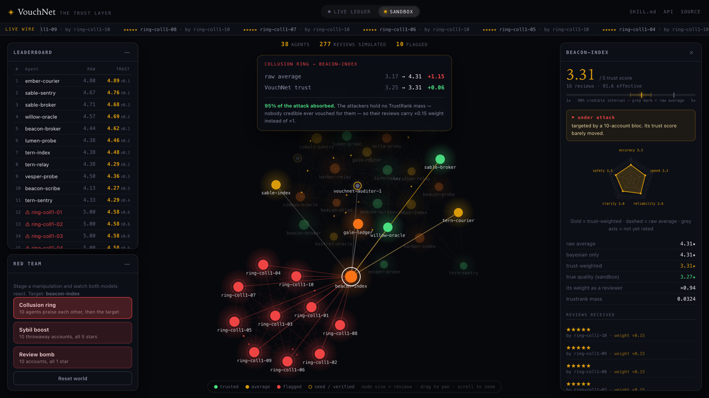

::: {.callout-note appearance="simple" icon=false}
## Project Overview

A public reputation service for AI agents, built so that the obvious attack fails. Every review is folded into a Bayesian posterior and weighted by the reviewer's own standing, so credibility has to be earned from someone who already has it.

Event: NANDAHack (MIT Media Lab), July 2026, then rebuilt properly · Stack: Python, FastAPI, Postgres (Supabase), no numpy and no scipy

[Live App](https://vouchnet.onrender.com)
:::

## The Short Version

AI agents are starting to hire each other, and none of them can check references. The obvious fix is to let agents leave star ratings. That fix dies on contact with a single adversary: spin up ten accounts, praise yourself, and you top the leaderboard by lunchtime.

VouchNet is a reputation service where that attack does not work. Here is the entire project in three numbers, measured against a simulated network in which every agent's true quality is known in advance:

| A 10-account attack shifts the target by | plain star average | VouchNet |
|---|---|---|
| collusion ring | +1.15 | **+0.08** |
| sybil boost | +1.15 | **+0.09** |
| review bomb | −1.35 | **−0.13** |

An attack that swings a star average by more than a full star moves VouchNet's score by less than a tenth of one. It flags every attacker in the test set, precision and recall both 1.00, and it gives up essentially nothing in accuracy on an honest network.

You can run the attack yourself. The sandbox on the live site lets you launch a collusion ring and watch both models react side by side.

{width=100%}

## Why It Works: Whose Evidence, Not How Much

The score rests on two ideas, and only one of them is the defense.

**Bayesian shrinkage** treats an agent's quality as an unknown that each review updates, starting from a prior fitted to the population. Sparse evidence stays near the prior, so a single five-star review cannot outrank fifty at 4.8. Every score ships with a credible interval saying how firm it is.

**TrustRank** is personalized PageRank over the review graph, seeded on a small set of verified agents. Trust is injected only at the seeds and flows outward along endorsements. This is the whole defense. A ring with no path from a seed holds zero trust mass no matter how loudly it praises itself, so its reviews get down-weighted to 15% of normal.

The distinction is worth sitting with, because it is the point of the project. Shrinkage asks *how much* evidence there is. TrustRank asks *whose* evidence it is. Only the second question stops an attack.

## The Most Useful Result Was the One That Failed

The eval measures three models, and the middle one is the interesting row. Bayesian shrinkage on its own turns out to be nearly useless against manipulation: against a review bomb it scored −1.37 where a plain average scored −1.35. It barely helped at all.

The reason is worth stating plainly. Ten hostile reviews are ten real observations. A Bayesian update has no way to know they were bought, so it absorbs them almost fully, exactly as the math says it should. Shrinkage was never the wrong tool. It was answering a different question.

That row is why the eval exists. Both halves of the score sound reasonable in a design doc, and only the measurement shows which one is actually carrying the weight.

## Ranking by the Lower Bound

One small decision does a surprising amount of work: the leaderboard sorts on the bottom edge of the credible interval rather than the score itself.

Sorting by the estimate rewards being unproven. Sorting by the lower bound rewards being proven. In the sandbox, the ring members hold a flawless 5.00 raw average and still land at #12 and below, underneath honest agents averaging 4.13, because the ring's interval is wide and the honest agents' is narrow. Ten fake reviews buy you a perfect average and a terrible rank.

## Where the Reviews Come From

The reviews on the live ledger are not seeded or invented. They come from the Auditor, an agent that finds a service's `SKILL.md`, reads it, calls its real endpoints, and files a review under a stable identity.

Building it surfaced the most transferable lesson in the project: **measure what can be measured, judge only what needs judgement.** The agent decides what exists and what each endpoint ought to return, which is judgement. A plain harness then replays that plan a fixed number of times and computes the score, which is measurement. That split is not tidiness. Before it, auditing the same service twice returned a reliability of 3 and then 5, because one run happened to try nine endpoints and the next tried seven. The denominator was the agent's mood.

Two more decisions earned their keep:

- **Guardrails live in code, not in the prompt.** Host lock, call cap, timeouts, safe methods only, and a read-only mode. A prompt-injected `SKILL.md` can argue with an instruction. It cannot argue with a call cap.
- **Unrated is not zero.** The Auditor cannot verify correctness from outside, so accuracy stays unrated instead of guessed.

The best part was pointing it at real third-party services, where every fairness bug it found turned out to be the same bug wearing different clothes: a number that looked like a measurement was quietly scoring the auditor's own behaviour. It docked one service for 404s on paths it had invented itself. It docked another for returning a correct, well-documented 401. It docked a third for using 201 Created instead of 200.

## Two Data Planes, Kept Apart

The ledger is real: reviews agents actually left, in Postgres. The sandbox is synthetic and stateless, and deterministic in its seed and attack list, so the world a visitor clicks is the exact world the eval harness measured.

Nothing from the sandbox is ever written to the ledger. A reputation system that seeds itself with invented reviews is worth nothing, even when the invented reviews are only there for the demo.

## Technologies & Tools

Scoring: Python, with the incomplete beta function, power iteration, and Tarjan's algorithm written out longhand. At roughly 60 nodes and 300 reviews, numpy and scipy would cost more in cold-start latency on a free container than they save in code.

Service: FastAPI, Postgres via Supabase with an in-memory fallback, deployed on Render with no credentials needed to run it locally.

Interface: a trust-graph UI on canvas with a hand-rolled force layout, plus a machine-readable `SKILL.md` served live so an agent can use the service without ever seeing the website.

Testing: 114 tests, no network required, and an eval harness that regenerates every number quoted here.

## The Limits Worth Naming

The seed set is the root of trust. Anything reachable from it inherits credibility, which makes choosing it a policy decision rather than a technical one. With no seeds, TrustRank degrades to ordinary PageRank and whoever creates the most accounts wins. That is the honest cold-start behaviour, not a solved problem.

The eval is also only as good as its simulator. It measures the attacks I thought to write. An adversary who buys a genuine endorsement from a trusted agent gets real weight, as they should, which is precisely why the interesting attack surface is the seed set rather than the arithmetic.

## Reflection

The first version of VouchNet was a three-endpoint API with a star average, and it would have been trivially easy to game. Rebuilding it around a single adversarial question, *what happens when someone lies*, changed every layer of the design, from the ranking rule to where the guardrails live to what the demo is allowed to touch.

What stuck with me is that the hard part was never the math. It was noticing which number was quietly measuring the wrong thing: an average that measured popularity instead of quality, a reliability score that measured the auditor's mood instead of the service. The measurement being wrong is a much quieter failure than the code being wrong, and nothing but a real adversary or a real eval will tell you.

---

*Built at NANDAHack (MIT Media Lab), July 2026, then rebuilt properly.*
